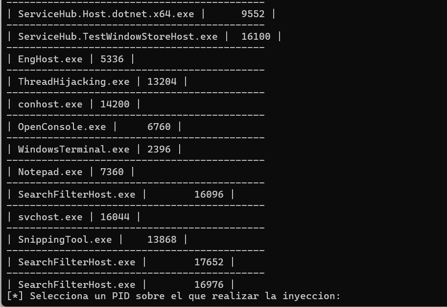
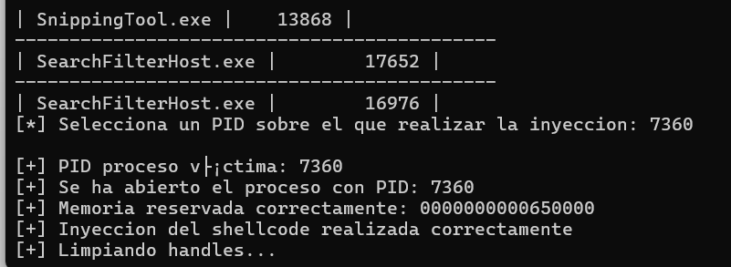
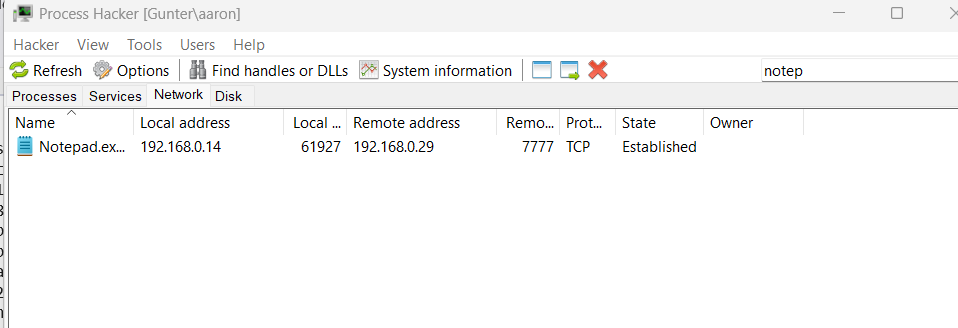
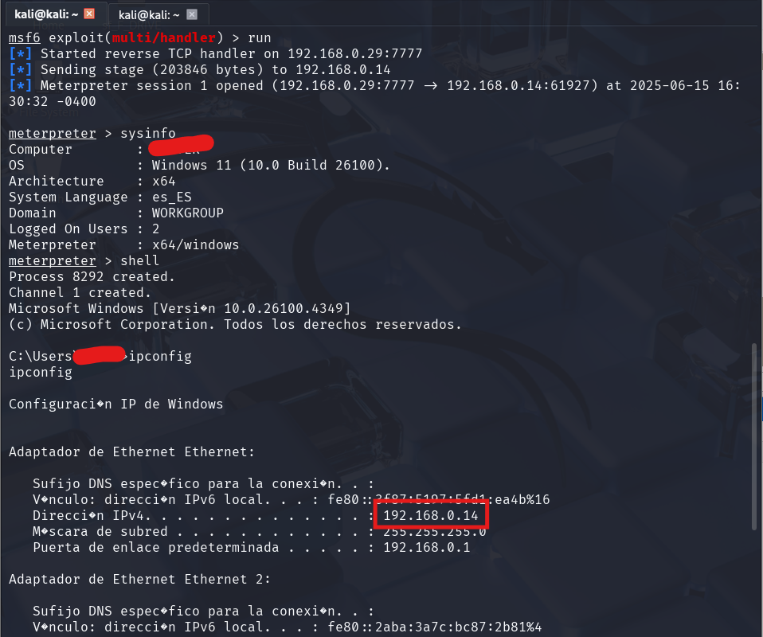
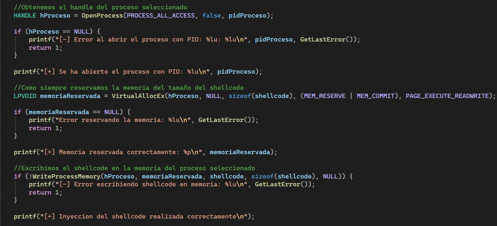
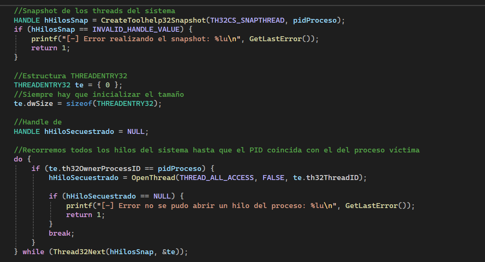
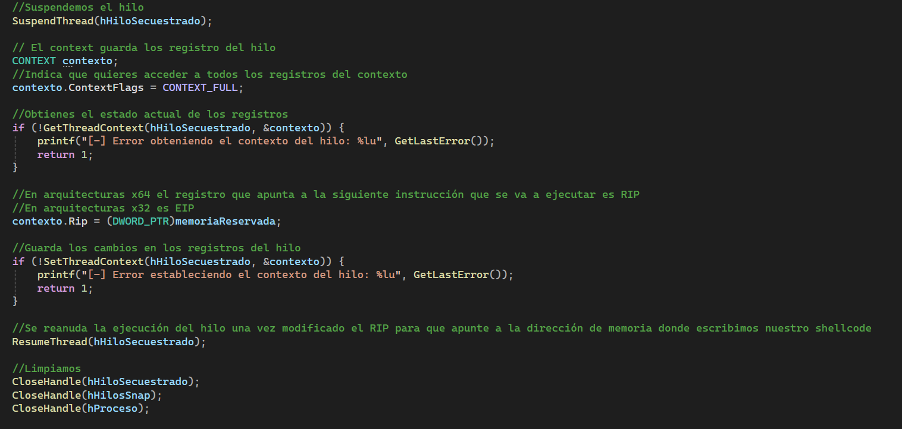

# threadHijacking
## Funcionamiento del programa

El programa permanece a la espera de que el usuario seleccione el proceso sobre el cual se llevará a cabo el secuestro de hilo.

En este ejemplo, se selecciona el PID del proceso `notepad.exe`, que en este caso es `7360`:

Una vez seleccionado el proceso, se realiza directamente la inyección del `shellcode`:

Si ahora abrimos la herramienta `Process Hacker 2`, podemos observar que `notepad.exe` está estableciendo una conexión con mi máquina Kali a través del puerto `7777`:

En este caso, se generó un `shellcode` para recibir una conexión de tipo `meterpreter`:

## Código

A continuación se destacan las partes más relevantes del código para comprender el funcionamiento y la correcta ejecución de la técnica de inyección mediante ``thread hijacking``.

### 1.  Inyección de `shellcode`

En la primera parte del programa, se siguen los pasos típicos de una inyección de `shellcode`:

- Se abre un `handle` al proceso víctima con `OpenProcess()`.
    
- Se reserva memoria dentro del proceso objetivo usando `VirtualAllocEx()`.
    
- Se escribe el `shellcode` en la memoria reservada mediante `WriteProcessMemory()`.

### 2. Localización de hilos (`threads`)

La segunda fase consiste en obtener todos los hilos del sistema mediante `CreateToolhelp32Snapshot()` y recorrerlos con un bucle `do...while`, hasta encontrar un hilo perteneciente al proceso víctima. Esto se logra comparando el PID del proceso con el campo `th32OwnerProcessID` de la estructura `THREADENTRY32`.

### 3. Secuestro y redirección del hilo

Finalmente, se realiza el secuestro del hilo. Este proceso es similar a la explotación de un desbordamiento de búfer (`buffer overflow`), ya que se manipula el flujo de ejecución del hilo:

1. Se **suspende** el hilo objetivo con `SuspendThread()`.
    
2. Se obtiene el contexto del hilo (registro de CPU) usando `GetThreadContext()`.
    
3. Se **modifica el registro `RIP`** (en sistemas x64) para que apunte a la dirección donde fue inyectado el `shellcode`. En sistemas x86, este registro sería `EIP`.
    
4. Se guarda el nuevo contexto con `SetThreadContext()`.
    
5. Finalmente, se **reanuda la ejecución del hilo** con `ResumeThread()`, lo que provoca que el hilo comience a ejecutar el código malicioso.

